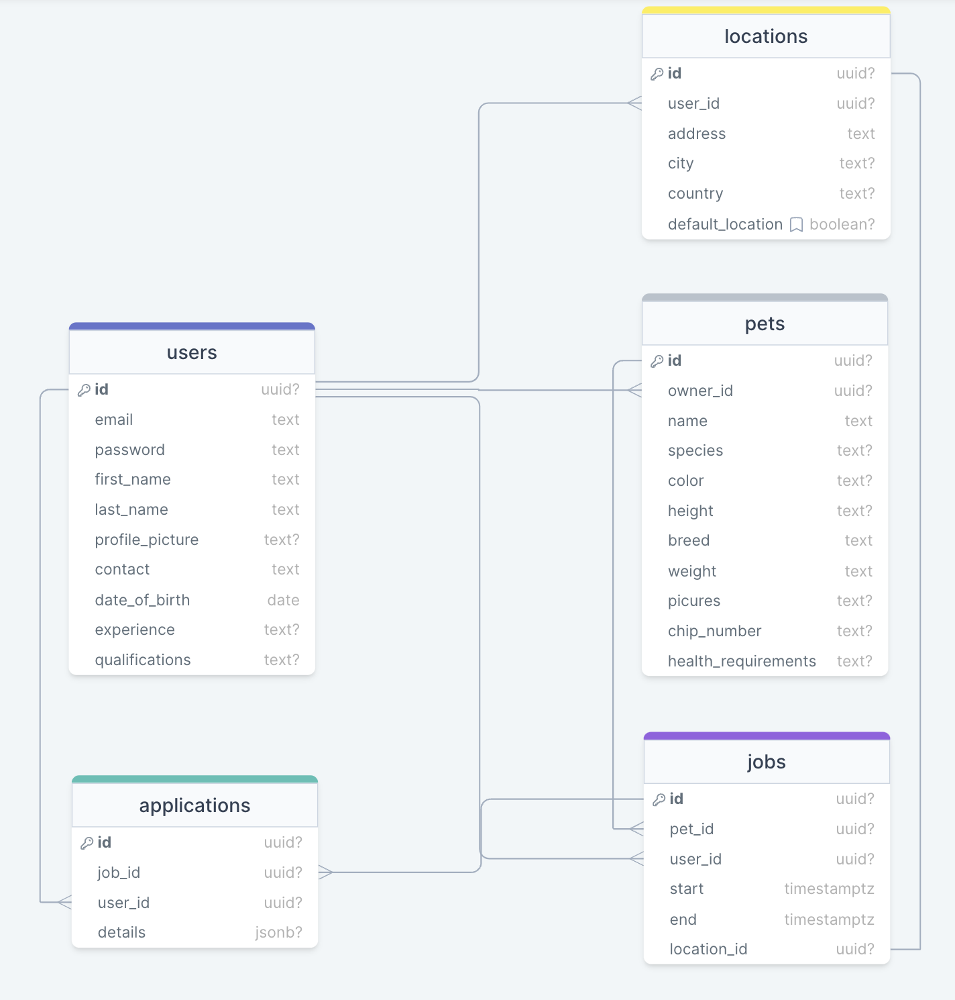

# Team Project repo

**PLEASE USE PYTHON 3.8 ONLY**

### Connect with Postgres on RDS

Ask me for the password. (@kolharsam)

```sh

$ psql --host=awseb-e-n3h4ykpptm-stack-awsebrdsdatabase-5tlrcwj3rs0l.ckzyhv20mvw0.us-east-1.rds.amazonaws.com --port=5432 --username=root --password --dbname=ebdb

```

make sure you have the `postgresql@14` suite of tools installed.

Or you could use tools like PopSQL and/or pgAdmin.

### Command to connect to a database locally (you can use the docker-compose file in the docker folder)

```sh

$ docker compose -f "docker/pg-local.docker-compose.yml" up -d # to start the postgres db

$ psql --host=localhost --port=5432 --username=postgres --password --dbname=postgres # password is also "postgres"

$ docker compose -f "docker/pg-local.docker-compose.yml" down # to stop the db

```


### How to run the app locally

```sh

$ python manage.py runserver --settings=furbaby.local_settings

```

### How to work locally when doing any migrations

```sh

$ python manage.py migrate --database=local --settings=furbaby.local_settings

```

### Running the app & deploying.

```sh

$ python3 -m venv myvenv

$ eb init

$ eb create "<YOUR_NAME>-furbaby-dev"

$ eb deploy

```

### How to setup a pre-commit hook

NOTE: All of the steps down below are assuming that you're in the root dir. of the repository.

- create a file called `pre-commit`

```sh

$ touch ./.git/hooks/pre-commit

```

- add the following code to it:

you can use `vim` or `nano` (preferred) to add the code

```sh

#!/bin/sh

ROOT_DIR=$(git rev-parse --show-toplevel)
source $ROOT_DIR/myvenv/bin/activate

black . # this is the code formatter (very opinionated)
# pylint --load-plugins=pylint_django 
# ^ this part isn't working for python3 and django v4
# (I'm still looking for solutions)
pylint $ROOT_DIR/furbaby/furbaby/
# we'll need to keep adding all of the modules that we
# want linted to the command above

deactivate

```

- make the `pre-commit` file executable

```sh

$ chmod +x ./.git/hooks/pre-commit

```

- start making your commits! ✌️

### Django Superuser Info

- username: `furbaby-admin`
- password: ask me (@kolharsam)

### How to create manual migrations

- Activate your virtual environment &amp; head into the `furbaby` directory (if you were in the root directory of the repo).
- Run the following command to create the migration file under the `api/migrations/` directory.

```sh

$ python manage.py makemigrations api --name "<migration_name>" --empty

```

- It's going to create a file that looks something like this:

```python

from django.db import migrations


class Migration(migrations.Migration):

    dependencies = [
        ('api', 'previous_name_001.py'),
        # NOTE: INSERT THE MIGRATION FILES THAT CAME BEFORE THIS CURRENT ONE
    ]

    operations = [
        migrations.RunSQL('INSERT YOUR SQL HERE')
    ]

```

- Preferrably use the `sql` directory to store all SQL.

### How to see the SQL generated for any migration that you create

```sh

$ python manage.py sqlmigrate --database=local --settings=furbaby.local_settings api "<full_name_of_migration>"

```

### DB Diagram


